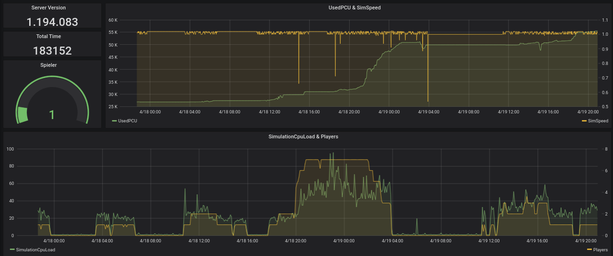

# pyvrageremoteapi

Python implementation for the VRage Remote API by Keen Software House,
as documented under [https://www.spaceengineersgame.com/dedicated-servers.html].

Tested with Space Engineers 1.194.083, should work with Medieval Engineers
as well.

Can be called via commandline (see below) or imported as module.

Currently, only GET operations are supported. Feel free to submit a Pull
Request or an issue.

## Usage

```bash
usage: vrageremoteapi.py [-h] --url URL --key KEY --resource RESOURCE

-h, --help           show this help message and exit
--url URL            of the remote server, e.g. http://localhost:8080
--key KEY            secret key for the remote API, e.g.
                      XKb8xk7vrKaq+BpallYnGA==
--resource RESOURCE  resource to be fetched, e.g. server/ping
```

The result is presented as JSON string.

For example:

```bash
> python3 vrageremoteapi.py --url http://localhost:8080 --key XKb8xk7vrKaq+BpallYnGA== --resource server/ping
{'data': {'Result': 'Pong'}, 'meta': {'apiVersion': '1.0', 'queryTime': 0.3032}}
```

## Example

For demonstration purposes, see `spaceengineersmetrics.py`, which fetches
fetches current information from a given server and puts it into an InfluxDB.
Using this, you can keep track of the performance of your server and
visualize statistics.

Should be called regularly, i.e. via crontab.

Usage:

```bash
python3 spaceengineersmetrics.py --url http://localhost:8080 --key XKb8xk7vrKaq+BpallYnGA== --db_host localhost
```


